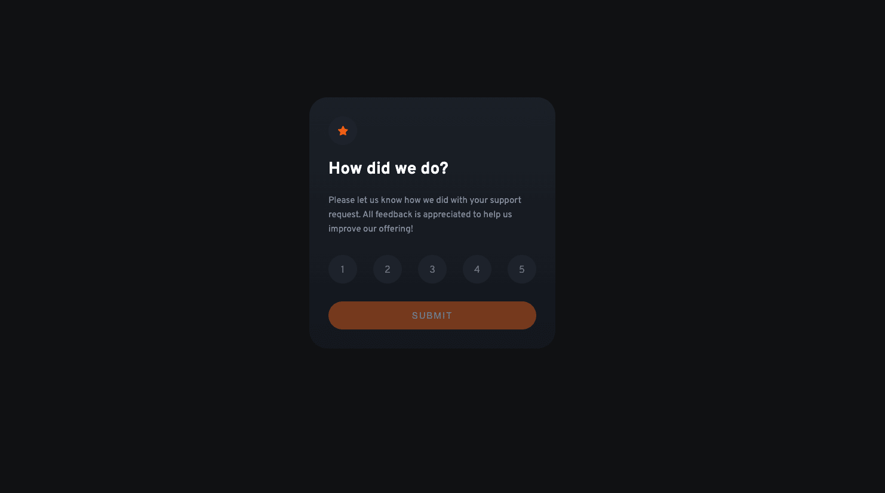

# Frontend Mentor - Interactive rating component solution

This is a solution to the [Interactive rating component challenge on Frontend Mentor](https://www.frontendmentor.io/challenges/interactive-rating-component-koxpeBUmI). Frontend Mentor challenges help you improve your coding skills by building realistic projects. 

## Table of contents

- [Overview](#overview)
  - [The challenge](#the-challenge)
  - [Screenshot](#screenshot)
  - [Links](#links)
- [My process](#my-process)
  - [Built with](#built-with)
  - [What I learned](#what-i-learned)
  - [Further development](#further-development)
  - [Useful resources](#useful-resources)
- [Author](#author)

**Note: Delete this note and update the table of contents based on what sections you keep.**

## Overview

### The challenge

Users should be able to:

- View the optimal layout for the app depending on their device's screen size
- See hover states for all interactive elements on the page
- Select and submit a number rating
- See the "Thank you" card state after submitting a rating

### Screenshot



### Links

- Solution URL: [https://github.com/merrellj-codeup/rating-component](https://github.com/merrellj-codeup/rating-component)
- Live Site URL: [https://codeup-rating-component.web.app/](https://codeup-rating-component.web.app/)

## My process
I started by building the static HTML and CSS. I used CSS variables to create a color palette for the project, which I based off of the provided Figma file. I then added the JavaScript to make the rating interactive. I used JavaScript modules to separate the concerns of the JavaScript. I then added the "Thank you" card state after the rating is submitted.

### Built with

- Semantic HTML5 markup
- CSS custom properties
- Flexbox
- JavaScript modules

### What I learned

I took on something simple for my first challenge, using some of the principles I teach in class: semantic HTML, CSS variables/custom properties, and JavaScript modules. I used modern CSS selectors to put as much of the styling in the CSS as possible. For example, I used the CSS sibling selector to ensure `:checked` radio inputs applied styling to the custom radio elements automatically:

```css
.rating-label input:checked + .circle-wrapper {
  background-color:var(--medium-grey);
  color: var(--pure-white);
}
.rating-label input:checked + .circle-wrapper:hover {
  background-color:var(--orange);
  color: var(--pure-white);
}
```

I also expanded on the UX of the `disabled` attribute on the submit button by adding the `pointer-events` property until a rating is selected:

```css
.button[disabled] {
  pointer-events: none;
  opacity: 0.5;
}
```

In JavaScript, I did stumble on an interesting form class that's native to JS: `FormData()`. Before I used to get each input value individually, but this class allows you to get all the values at once. I used the following on the event listener for the submit button:

```js
const form = e.target.closest('form');
const formData = new FormData(form);
const data = Object.fromEntries(formData.entries());
```

I'll definitely be using this in the future!

### Further development

While placing a `div` inside a `label` is not compliant with the HTML5 specification, in practice, many modern browsers are quite forgiving and will still allow the `label` to work as expected. This is a bit of a hack, but it's a common one. If I were to resolve this, I would have to bring the hidden `input` and the `div` that represents it out of the `label`, and then use the `for` attribute on the `label` to associate it with the `input`. I would then have to wrap all three with a parent element and use CSS to position the `label` absolutely over top of the `div` that represents the `input`. This would be a lot of work for a small gain, so I decided to leave it as is.

### Useful resources

- [FormData](https://developer.mozilla.org/en-US/docs/Web/API/FormData) - Documentation on the FormData class in JavaScript. I used this to get all the form values at once.
- [CSS Custom Properties (CSS Variables)](https://developer.mozilla.org/en-US/docs/Web/CSS/--*) - Documentation on CSS variables. I used this to create the color palette for the project.
- [JavaScript Modules](https://developer.mozilla.org/en-US/docs/Web/JavaScript/Guide/Modules) - Documentation on JavaScript modules. I used this to create the JavaScript for the project and practice better separation of concerns.

## Author

- GitHub - [Jason Merrell](https://github.com/merrellj-codeup)
- Codeup - The bootcamp school I teach at: [Codeup](https://codeup.com)
- Frontend Mentor - [@merrellj-codeup](https://www.frontendmentor.io/profile/merrellj-codeup)
